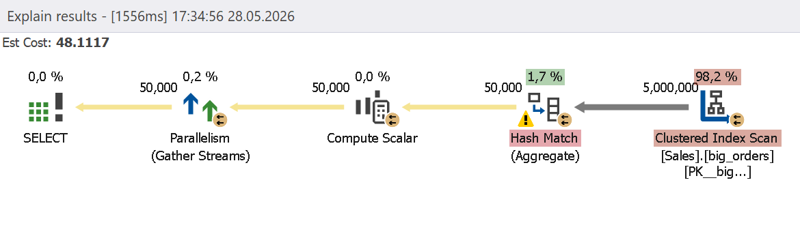
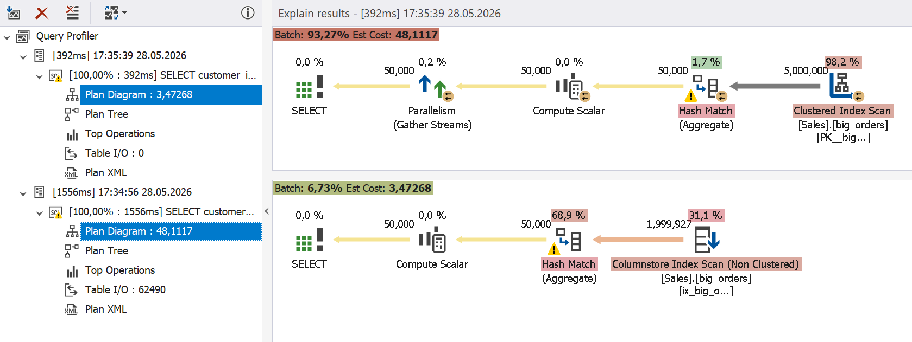

# Columnstore Indexes

A columnstore index stores data by column rather than by row. It can be useful in analytical and reporting workflows that require scanning large numbers of rows with only a few columns.

When applied to a table, a columnstore index has a significant impact on the performance of aggregation and reporting queries:

- I/O reduction from reading only the required columns
- Improved compression leading to lower disk space and read count
- Batch mode processing reducing the CPU overhead
- Faster aggregation

## How dbForge Query Profiler can help

The integrated Query Profiler in [dbForge Studios](https://www.devart.com/dbforge-studio.html) (and [dbForge Edge](https://www.devart.com/dbforge/edge/)) identifies large index scans that suggest optimization through the introduction of a columnstore index.

## Example

Before trying this scenario, delete the existing index with the following query.

```sql
DROP INDEX IF EXISTS ix_big_orders_columnstore
ON sales.big_orders;
GO
```

Execute the following query in the Query Profiler mode.

```sql
SELECT
customer_id,
COUNT(*) AS total_orders,
SUM(total_amount) AS total_amount,
AVG(total_amount) AS avg_amount
FROM sales.big_orders
GROUP BY customer_id;
GO
```

Query Profiler shows a clustered index scan of the entire dataset, which increases the execution time and logical read count.



To optimize this query, create a nonclustered columnstore index that includes the columns requested by the query (`customer_id`, `total_amount`).

```sql
CREATE NONCLUSTERED COLUMNSTORE INDEX ix_big_orders_columnstore
ON sales.big_orders
(
    customer_id,
    total_amount
);
```

Rerun the query in the Query Profiler mode. After the optimization, the server performs a nonclustered index scan and uses the batch processing mode, which reduces the CPU load and execution cost.



