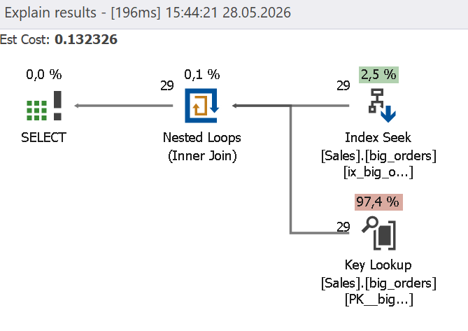
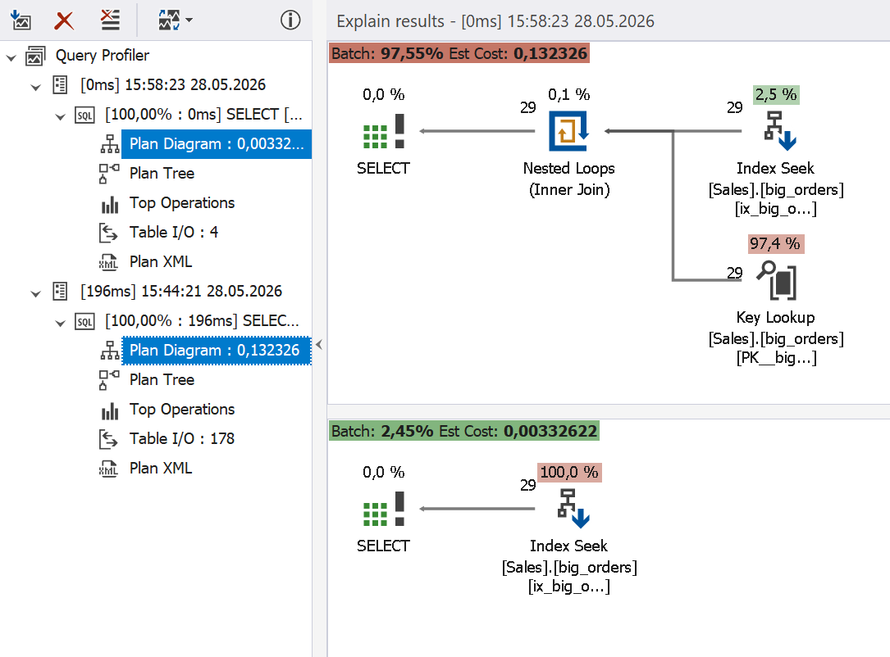

# Covering Indexes

A covering index can significantly improve query performance because it allows the engine to respond to a query entirely from the index without accessing the table to retrieve all columns. A covering index that satisfies a query contains everything the query needs:

- All columns used in the WHERE, JOIN, and ORDER BY clauses
- All columns returned in response to the SELECT statement

A correctly set up covering index brings the following performance benefits:

- Key lookup elimination
- I/O reduction
- CPU efficiency improvement
- Performance improvement on large datasets

## How Query Profiler can help

Query Profiler highlights key lookups that increase the execution cost and read count.

## Example

Before trying this scenario, delete indexes with the following query.

```sql
IF EXISTS
(
SELECT 1
FROM sys.indexes
WHERE name = 'ix_big_orders_customer_id'
)
BEGIN
 
DROP INDEX ix_big_orders_customer_id
ON sales.big_orders;
 
END
GO
 
IF EXISTS
(
SELECT 1
FROM sys.indexes
WHERE name = 'ix_big_orders_customer_id_covering'
)
BEGIN
 
DROP INDEX ix_big_orders_customer_id_covering
ON sales.big_orders;
 
END
GO
```

Create a nonclustered index.

```sql
CREATE INDEX ix_big_orders_customer_id
ON sales.big_orders(customer_id);
GO
```

Execute the following query in the Query Profiler mode.

```sql
SELECT
customer_id,
order_date,
total_amount,
order_status
FROM sales.big_orders
WHERE customer_id = 1000;
```

Query Profiler shows how query performance is affected by the key lookup.



The issue is that the nonclustered index only contains the `customer_id` column, while the rest of the columns included in the query had to be accessed by an additional key lookup.

To optimize this query, replace the nonclustered index with a covering index.

```sql
DROP INDEX ix_big_orders_customer_id
ON sales.big_orders;

 
CREATE INDEX ix_big_orders_customer_id_covering
ON sales.big_orders(customer_id)
INCLUDE
(
order_date,
total_amount,
order_status
);
GO
```

When you rerun the query, Query Profiler shows an improvement in query performance. The covering index includes all the required columns, which eliminates the need to perform key lookup and allows the engine to retrieve all the requested data by index seek. 


