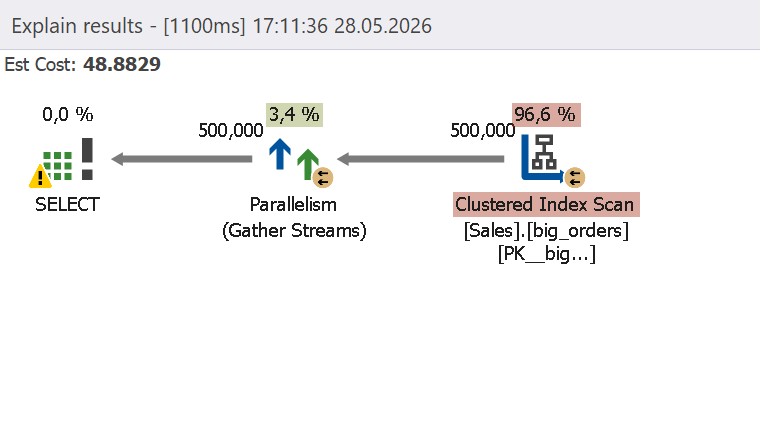
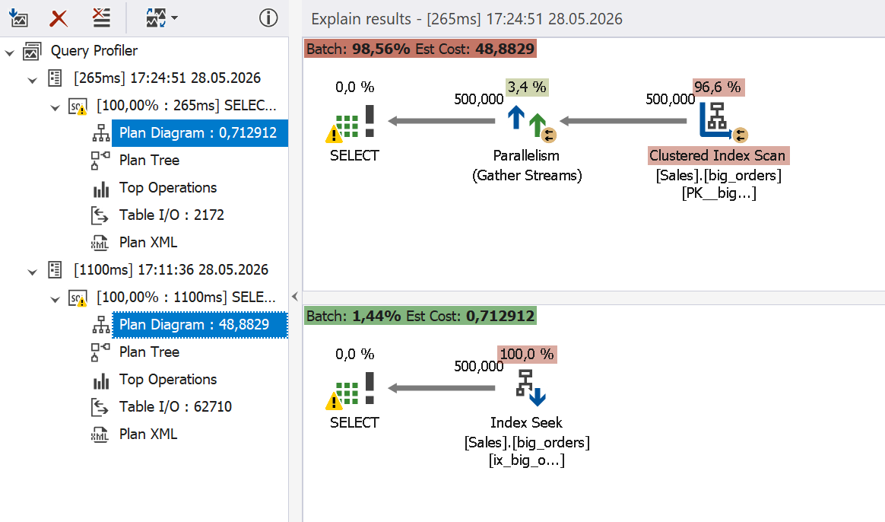

# Filtered Indexes

A filtered index is an index that only contains a subset of table rows that match a specified filter condition. By providing only the data that the query needs, a filtered index can greatly improve performance by eliminating the necessity to scan the entire table.

A filtered index can improve query efficiency in more than one way:

- I/O reduction
- Selective index seeks resulting in higher efficiency
- Lower maintenance overhead

## How dbForge Query Profiler can help

The integrated Query Profiler in [dbForge Studios](https://www.devart.com/dbforge-studio.html) (and [dbForge Edge](https://www.devart.com/dbforge/edge/)) shows inefficient clustered index scans, where a clustered index can be replaced with a filtered one.

## Example

Before trying this scenario, delete indexes with the following query.

```sql
DROP INDEX IF EXISTS ix_big_orders_active
ON sales.big_orders;
GO
 
DROP INDEX IF EXISTS ix_big_orders_filtered_cancelled
ON sales.big_orders;
GO
```

Add a simple index as follows.

```sql
CREATE INDEX ix_big_orders_active
ON sales.big_orders(order_status);
GO
```

The following query filters data by `order_status = 'C'`. This value occurs rarely in the database, but SQL Server has to scan multiple pages to execute the query. As a result, the I/O and execution time increase.


```sql
SELECT
order_id,
customer_id,
order_date,
total_amount
FROM sales.big_orders
WHERE order_status = 'C';
GO
```

Query Profiler shows a clustered index scan, which results in a high execution cost.



The query has to perform a clustered index scan because the index does not include all the necessary columns. 

To optimize this query, replace the clustered index with a filtered covering index that covers all required columns with a filter matching the WHERE condition.

```sql
DROP INDEX ix_big_orders_active
ON sales.big_orders;

 
CREATE INDEX ix_big_orders_filtered_cancelled
ON sales.big_orders(order_status)
INCLUDE
(
order_id,
customer_id,
order_date,
total_amount
)
WHERE order_status = 'C';
```

Rerun the query in the Query Profiler mode. The filtered index eliminates the need for a clustered index scan and enables obtaining the requested data directly by index seek. 


