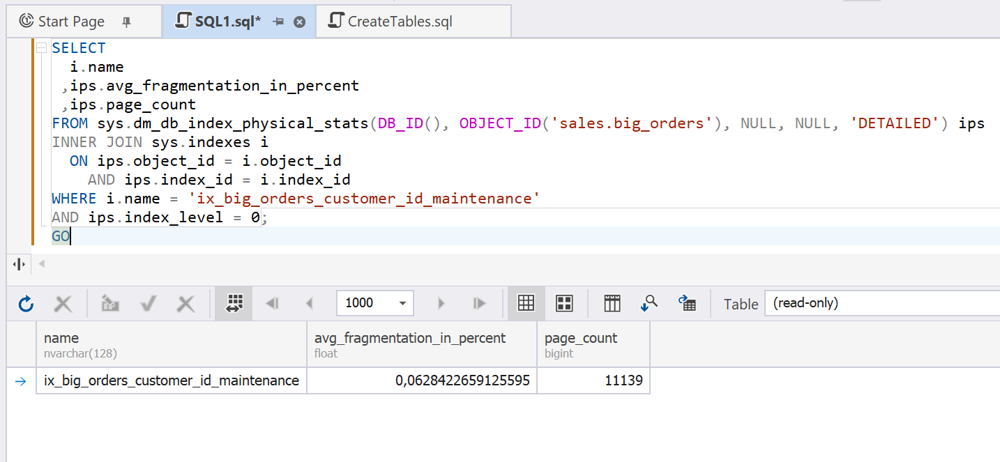
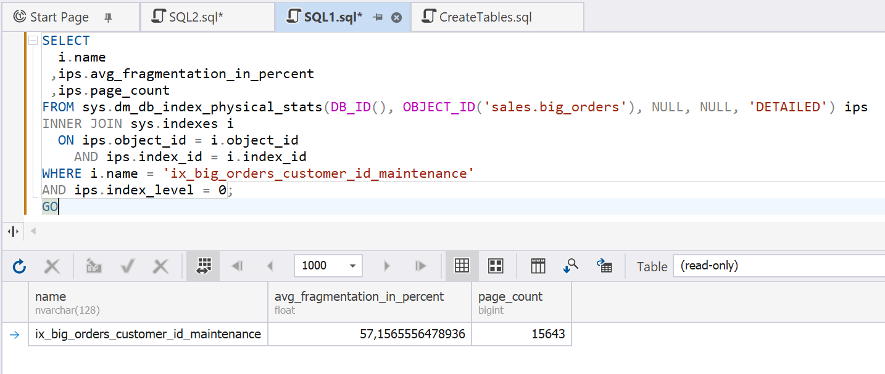
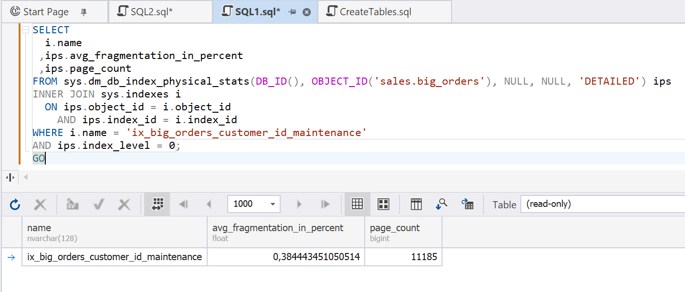
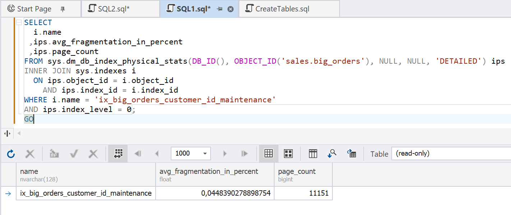

# Index Maintenance

Fragmented indexes can degrade query performance. Index fragmentation occurs after multiple INSERT, UPDATE, and DELETE operations and results in:

- Higher I/O
- Lower index read efficiency
- Suboptimal query performance
- Increased disk subsystem load

## Example

This example uses a Dynamic Management View: `sys.dm_db_index_physical_stats`.

Start with creating an index as follows.

```sql
IF EXISTS
(
    SELECT *
    FROM sys.indexes
    WHERE name = 'ix_big_orders_customer_id_maintenance'
      AND object_id = OBJECT_ID('sales.big_orders')
)
DROP INDEX ix_big_orders_customer_id_maintenance
ON sales.big_orders;
GO
 
CREATE INDEX ix_big_orders_customer_id_maintenance
ON sales.big_orders(customer_id);
GO
```

Evaluate index fragmentation with the following query.

```sql
SELECT
    i.name,
    ips.avg_fragmentation_in_percent,
    ips.page_count
FROM sys.dm_db_index_physical_stats
(
    DB_ID(),
    OBJECT_ID('sales.big_orders'),
    NULL,
    NULL,
    'DETAILED'
) ips
INNER JOIN sys.indexes i
    ON ips.object_id = i.object_id
   AND ips.index_id = i.index_id
WHERE i.name = 'ix_big_orders_customer_id_maintenance'
  AND ips.index_level = 0;
GO
```

Typically, index fragmentation is almost 0.



Create index fragmentation by adding a large number of rows.

```sql
DECLARE @i int = 1;
 
WHILE @i <= 10000
BEGIN
 
    INSERT INTO sales.big_orders
    (
        customer_id,
        salesperson_id,
        territory_id,
        order_date,
        ship_date,
        total_amount,
        tax_amount,
        freight,
        order_status,
        payment_method
    )
    VALUES
    (
        ABS(CHECKSUM(NEWID())) % 50000 + 1,
        ABS(CHECKSUM(NEWID())) % 1000 + 1,
        ABS(CHECKSUM(NEWID())) % 100 + 1,
        GETDATE(),
        DATEADD(day, 5, GETDATE()),
        RAND() * 10000,
        RAND() * 1000,
        RAND() * 500,
        'C',
        'Card'
    );
 
    SET @i += 1;
 
END
GO
```

Now, delete some rows.

```sql
DELETE TOP (5000)
FROM sales.big_orders
WHERE order_id IN
(
    SELECT TOP (5000)
           order_id
    FROM sales.big_orders
    ORDER BY NEWID()
);
GO
```

Check index fragmentation again. It has reached 57%.



There are two methods of optimizing fragmented indexes: reorganization and rebuilding. Both reduce index fragmentation, improving SQL Server read efficiency and lowering the disk subsystem load.

### Reorganization

```sql
ALTER INDEX ix_big_orders_customer_id_maintenance
ON sales.big_orders
REORGANIZE;
GO
```

Check index fragmentation after reorganization.

Index reorganization results in a significant reduction in fragmentation; however, it remains higher than 0%.



### Rebuilding

```sql
ALTER INDEX ix_big_orders_customer_id_maintenance
ON sales.big_orders
REBUILD;
GO
```

Index rebuilding lowers fragmentation to 0%, improving the performance.


