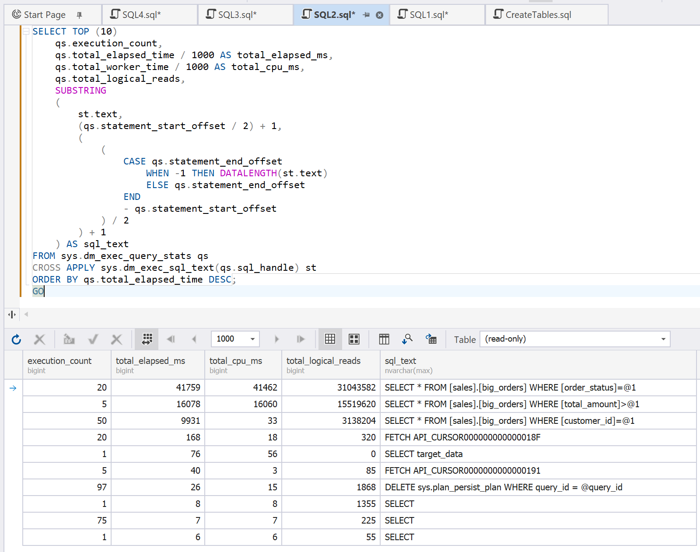
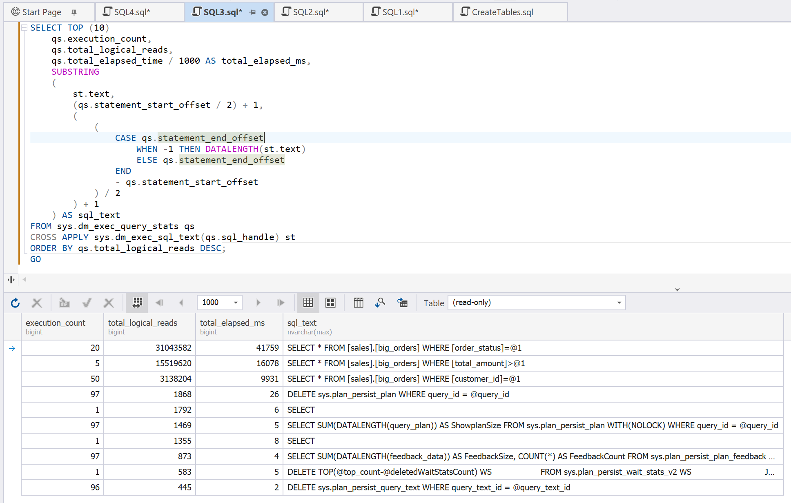
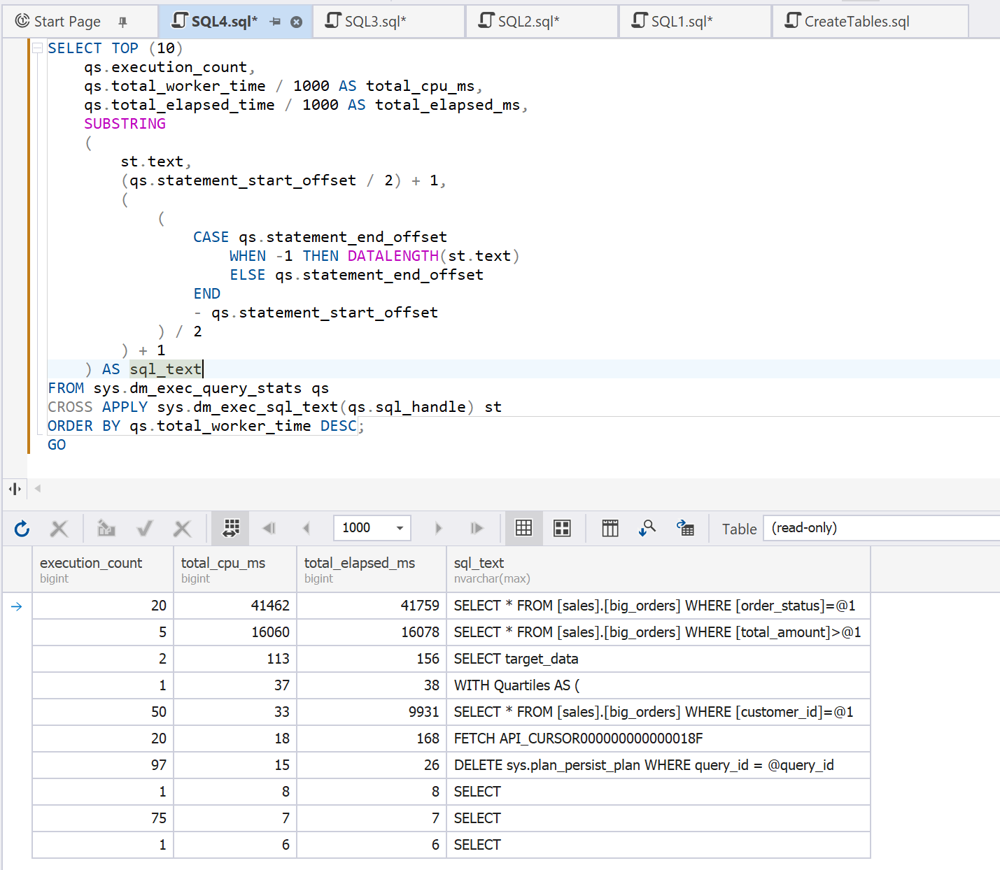

# DMV Queries

Dynamic Management Views (DMVs) allow you to analyze performance taking into account actual resource consumption. They help you find:

- The most resource-heavy queries
- Queries that have the highest read count
- Queries that produce the largest CPU load

> DMVs reflect the state since the last server restart or plan cache clearing.

## Examples

Before trying the examples, clear the cache.

```sql
DBCC FREEPROCCACHE;
GO
```

Create a sample load.

```sql
SELECT *
FROM sales.big_orders
WHERE customer_id = 100;
GO 50
 
SELECT *
FROM sales.big_orders
WHERE order_status = 'C';
GO 20
 
SELECT *
FROM sales.big_orders
WHERE total_amount > 40000;
GO 5
```

Run the following queries to identify those that can benefit from optimization.

### Find queries with the longest execution time

```sql
SELECT TOP (10)
    qs.execution_count,
    qs.total_elapsed_time / 1000 AS total_elapsed_ms,
    qs.total_worker_time / 1000 AS total_cpu_ms,
    qs.total_logical_reads,
    SUBSTRING
    (
        st.text,
        (qs.statement_start_offset / 2) + 1,
        (
            (
                CASE qs.statement_end_offset
                    WHEN -1 THEN DATALENGTH(st.text)
                    ELSE qs.statement_end_offset
                END
                - qs.statement_start_offset
            ) / 2
        ) + 1
    ) AS sql_text
FROM sys.dm_exec_query_stats qs
CROSS APPLY sys.dm_exec_sql_text(qs.sql_handle) st
ORDER BY qs.total_elapsed_time DESC;
```



### Find queries with the highest logical read count

```sql
SELECT TOP (10)
    qs.execution_count,
    qs.total_logical_reads,
    qs.total_elapsed_time / 1000 AS total_elapsed_ms,
    SUBSTRING
    (
        st.text,
        (qs.statement_start_offset / 2) + 1,
        (
            (
                CASE qs.statement_end_offset
                    WHEN -1 THEN DATALENGTH(st.text)
                    ELSE qs.statement_end_offset
                END
                - qs.statement_start_offset
            ) / 2
        ) + 1
    ) AS sql_text
FROM sys.dm_exec_query_stats qs
CROSS APPLY sys.dm_exec_sql_text(qs.sql_handle) st
ORDER BY qs.total_logical_reads DESC;
```



### Find the most CPU-heavy queries

```sql
SELECT TOP (10)
    qs.execution_count,
    qs.total_worker_time / 1000 AS total_cpu_ms,
    qs.total_elapsed_time / 1000 AS total_elapsed_ms,
    SUBSTRING
    (
        st.text,
        (qs.statement_start_offset / 2) + 1,
        (
            (
                CASE qs.statement_end_offset
                    WHEN -1 THEN DATALENGTH(st.text)
                    ELSE qs.statement_end_offset
                END
                - qs.statement_start_offset
            ) / 2
        ) + 1
    ) AS sql_text
FROM sys.dm_exec_query_stats qs
CROSS APPLY sys.dm_exec_sql_text(qs.sql_handle) st
ORDER BY qs.total_worker_time DESC;
```



### Results

This analysis allows you to identify that the following query is the most resource-heavy with the highest execution time, CPU time, and logical read count.

```sql
SELECT *
FROM sales.big_orders
WHERE order_status = 'C';
```

At the same time, another query, although more frequent than others, has a significantly lower impact on performance.

```sql
SELECT *
FROM sales.big_orders
WHERE customer_id = 100;
```
