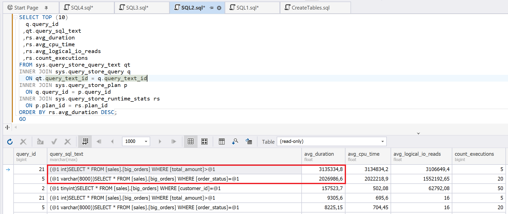
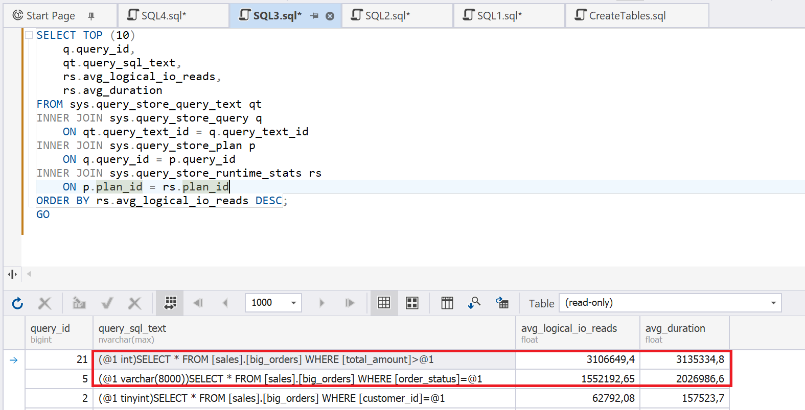
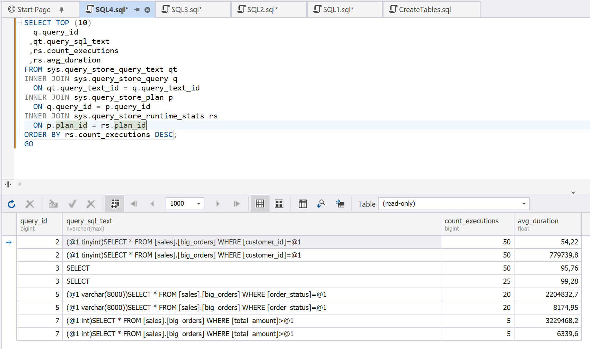

# Query Store Usage

Query Store is a SQL Server feature that automatically captures, stores, and tracks query execution history, execution plans, and runtime statistics. Serving as a repository for query performance data, Query Store helps you analyze issues and identify their root causes. Using Query Store, you can locate:

- The most frequently executed queries
- Queries that have the longest execution time
- Queries that have the highest read count

This information helps you optimize query performance.

Before using Query Store, verify that it is enabled for your database.

 ```sql
SELECT
    name,
    is_query_store_on
 FROM sys.databases
 WHERE name = DB_NAME();
 ```

 If Query Store is disabled, enable it as follows.

 ```sql
 ALTER DATABASE AdventureWorks2025
 SET QUERY_STORE = ON;
 ```

Clear the Query Store statistics.

```sql
ALTER DATABASE AdventureWorks2025
SET QUERY_STORE CLEAR;
GO
```

## Examples

Run the following queries that have different execution frequencies.

```sql

SELECT *
FROM sales.big_orders
WHERE customer_id = 100;
GO 50
 
SELECT *
FROM sales.big_orders
WHERE order_status = 'C';
GO 20
 
SELECT *
FROM sales.big_orders
WHERE total_amount > 40000;
GO 5
```

### Find queries with the longest execution time

```sql
SELECT TOP (10)
    q.query_id,
    qt.query_sql_text,
    rs.avg_duration,
    rs.avg_cpu_time,
    rs.avg_logical_io_reads,
    rs.count_executions
FROM sys.query_store_query_text qt
INNER JOIN sys.query_store_query q
    ON qt.query_text_id = q.query_text_id
INNER JOIN sys.query_store_plan p
    ON q.query_id = p.query_id
INNER JOIN sys.query_store_runtime_stats rs
    ON p.plan_id = rs.plan_id
ORDER BY rs.avg_duration DESC;
```



### Find queries with the highest read count

```sql
SELECT TOP (10)
    q.query_id,
    qt.query_sql_text,
    rs.avg_logical_io_reads,
    rs.avg_duration
FROM sys.query_store_query_text qt
INNER JOIN sys.query_store_query q
    ON qt.query_text_id = q.query_text_id
INNER JOIN sys.query_store_plan p
    ON q.query_id = p.query_id
INNER JOIN sys.query_store_runtime_stats rs
    ON p.plan_id = rs.plan_id
ORDER BY rs.avg_logical_io_reads DESC;
```



### Find the most frequently executed queries

```sql
SELECT TOP (10)
    q.query_id,
    qt.query_sql_text,
    rs.count_executions,
    rs.avg_duration
FROM sys.query_store_query_text qt
INNER JOIN sys.query_store_query q
    ON qt.query_text_id = q.query_text_id
INNER JOIN sys.query_store_plan p
    ON q.query_id = p.query_id
INNER JOIN sys.query_store_runtime_stats rs
    ON p.plan_id = rs.plan_id
ORDER BY rs.count_executions DESC;
```


