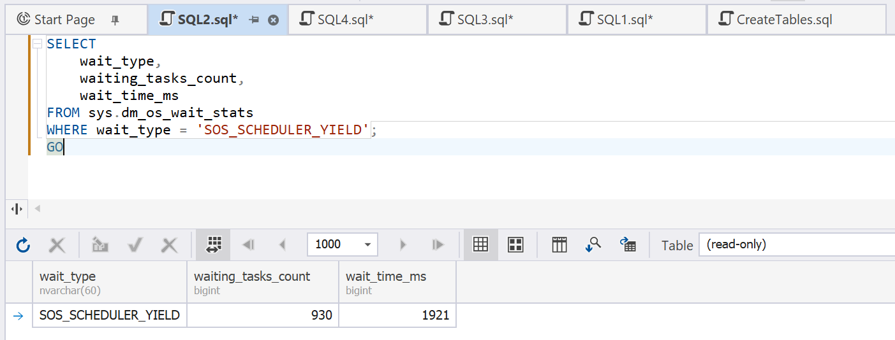
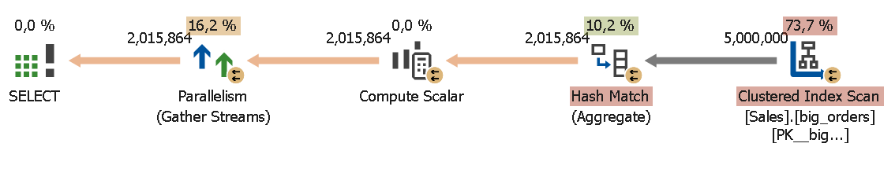
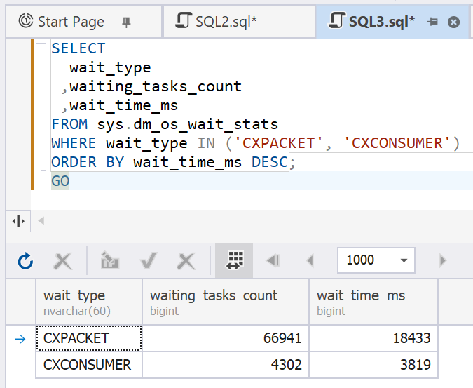
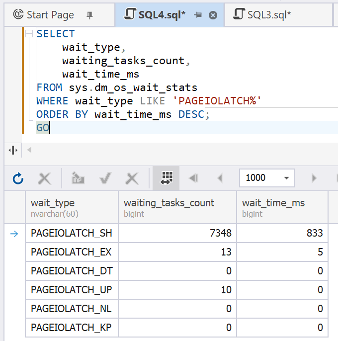
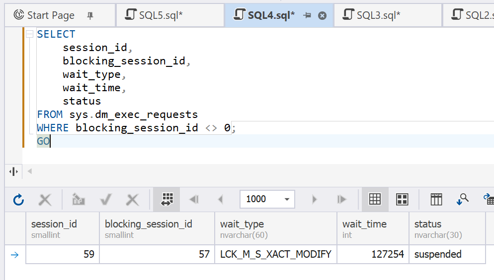

# Wait Statistics

Wait statistics can help you detect issues that affect database performance.

## CPU wait statistics

CPU wait statistics show high CPU loads. 

Before executing the example scenario, clear the statistics.

```sql
DBCC SQLPERF('sys.dm_os_wait_stats', CLEAR);
GO
```

Run the following query in three separate windows, setting the `WAITFOR TIME` 1 or 2 minutes ahead.

```sql
WAITFOR TIME '12:14:00';
 
SELECT
    SUM(CAST(order_id AS BIGINT) * customer_id)
FROM sales.big_orders
OPTION (MAXDOP 1);
GO
```

To obtain the CPU wait statistics, run the following query.

```sql
SELECT
    wait_type,
    waiting_tasks_count,
    wait_time_ms
FROM sys.dm_os_wait_stats
WHERE wait_type = 'SOS_SCHEDULER_YIELD';
```



The `SOS_SCHEDULER_YIELD` wait type represents the CPU wait caused by the simultaneous execution of several CPU-heavy queries, which leads to concurrency and performance deterioration.

## Parallelism in wait statistics

Parallelism occurs when a large query is divided into multiple smaller tasks that are executed simultaneously. Sometimes, parallelism may affect database performance. Wait statistics can help you identify parallelism and evaluate its influence on the overall performance.

Before executing the example scenario, clear the statistics.

```sql
DBCC SQLPERF('sys.dm_os_wait_stats', CLEAR);
GO
```

Typically, parallelism occurs in queries aggregating large amounts of data. 

```sql
SELECT
territory_id,
salesperson_id,
customer_id,
SUM(total_amount) AS total_sales,
AVG(total_amount) AS avg_sales,
COUNT(*) AS order_count
FROM sales.big_orders
GROUP BY territory_id,
salesperson_id,
customer_id
OPTION (MAXDOP 6);
```

Query Profiler confirms the presence of parallelism in the execution.



To obtain the wait statistics for this query, run the following.

```sql
SELECT
wait_type,
waiting_tasks_count,
wait_time_ms
FROM sys.dm_os_wait_stats
WHERE wait_type IN ('CXPACKET', 'CXCONSUMER')
ORDER BY wait_time_ms DESC;
```

This query returns the following wait types:

- CXPACKET: Wait during the parallel streams coordination
- CXCONSUMER: Wait in consumer streams

These types indicate parallelism in the query execution.



## Disk I/O wait statistics

Analyzing disk I/O wait statistics allows you to detect insufficient memory, excessive table scans, or a slow disk subsystem. It may be useful to request such statistics after queries reading large amounts of data.

Before executing the example scenario, clear the statistics.

```sql
DBCC SQLPERF('sys.dm_os_wait_stats', CLEAR);
GO
```

Clear the buffer cache.

```sql

CHECKPOINT;
GO
 
DBCC DROPCLEANBUFFERS;
GO
```

If you run the following query after the buffer cache is cleared, the server needs to read all data from the disk again.

```sql
SELECT *
FROM sales.big_orders;
```

To see the disk I/O wait statistics for this query, execute the following.

```sql
SELECT
wait_type,
waiting_tasks_count,
wait_time_ms
FROM sys.dm_os_wait_stats
WHERE wait_type LIKE 'PAGEIOLATCH%'
ORDER BY wait_time_ms DESC;
```

This query returns the `PAGEIOLATCH_SH` wait type indicating the time that the server spends waiting for the data to be loaded into the buffer cache. It can signal memory or disk issues that affect the performance.



## Lock wait statistics

This type of wait statistics shows the time that a transaction spends waiting for the resources blocked by another transaction. Such situations indicate concurrency issues and may lead to an increased execution time.

Before executing the example scenario, clear the statistics.

```sql
DBCC SQLPERF('sys.dm_os_wait_stats', CLEAR);
GO
```

Open two windows. In window 1, begin the following transaction and update a row without completing the transaction:

```sql
BEGIN TRANSACTION;
UPDATE sales.big_orders
SET total_amount = total_amount + 100
WHERE order_id = 1000;
```

In window 2, attempt to update the same row.

```sql
UPDATE sales.big_orders
SET total_amount = total_amount + 50
WHERE order_id = 1000;
GO
```

This query is in a wait state.

Run the following query to check the wait statistics.

```sql
SELECT
session_id,
blocking_session_id,
wait_type,
wait_time,
status
FROM sys.dm_exec_requests
WHERE blocking_session_id <> 0;
```



The `LCK_M_*` wait type returned by this query signals waits caused by unavailability of resources due to concurrency.

To unlock the query execution, complete the transaction in window 1.

```sql
ROLLBACK;
GO
```

OR

```sql
COMMIT;
GO
```

After the transaction is completed, the query resumes execution.
