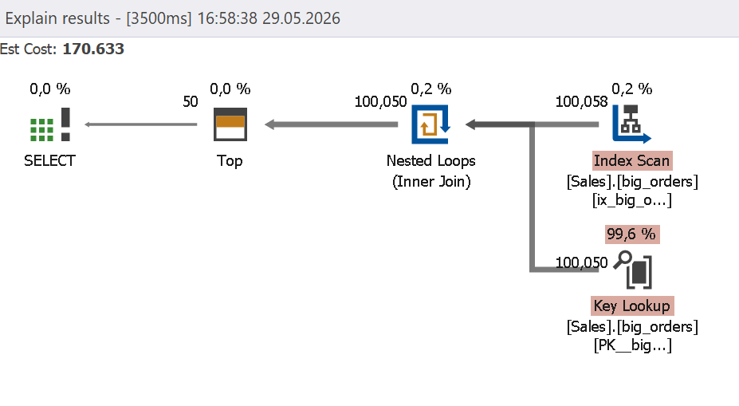
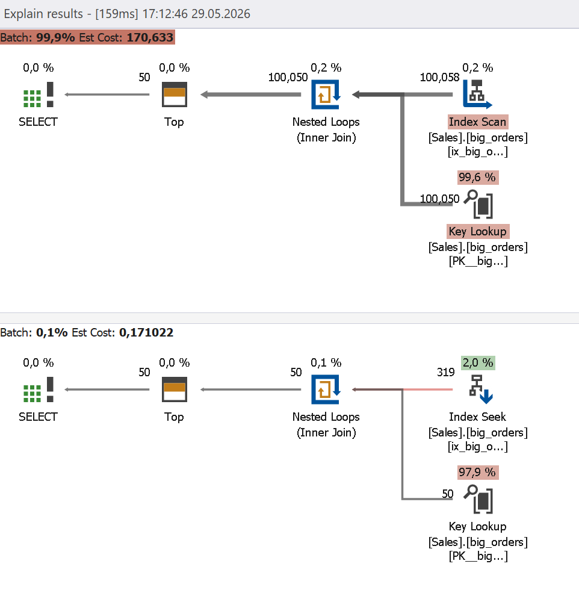

# Pagination Best Practices

Pagination can slow down queries, as the engine still needs to locate and skip the preceding rows before returning the requested ones. This is especially prominent as the page numbers increase: the server needs to perform a lot of work, but the result remains the same.

For example, when the pagination is set up as follows, the server needs to skip 100,000 rows before returning the requested 50.

```sql
OFFSET 100000 ROWS
FETCH NEXT 50 ROWS ONLY
```

As a result, the query requires a lot of CPU and memory resources, which slows it down.

## How dbForge Query Profiler can help

The integrated Query Profiler in [dbForge Studios](https://www.devart.com/dbforge-studio.html) (and [dbForge Edge](https://www.devart.com/dbforge/edge/)) highlights such expensive queries and locates the issue in the execution path.

## Example

Before trying this example, execute the following script.

```sql
IF EXISTS
(
    SELECT *
    FROM sys.indexes
    WHERE name = 'ix_big_orders_order_date'
      AND object_id = OBJECT_ID('sales.big_orders')
)
DROP INDEX ix_big_orders_order_date
ON sales.big_orders;
GO
 
CREATE INDEX ix_big_orders_order_date
ON sales.big_orders(order_date);
GO
```

Run the query below in the Query Profiler mode.

```sql
SELECT
order_id,
customer_id,
order_date,
total_amount
FROM sales.big_orders
ORDER BY order_date
OFFSET 100000 ROWS
FETCH NEXT 50 ROWS ONLY;
```

The query displays a high execution cost.



This query can be optimized by replacing OFFSET pagination with keyset pagination, where the table reading begins with the required value instead of skipping rows. For that, you need the value for the first page after the OFFSET.

```sql
SELECT
    order_date
FROM sales.big_orders
ORDER BY order_date
OFFSET 100000 ROWS
FETCH NEXT 1 ROW ONLY;
```

This query returns the `order_date` value, for example, `2016-08-12T16:57:20.710`. This value can be included in the original query instead of the OFFSET clause to make the server start reading from this value immediately.

```sql
SELECT TOP (50)
       order_id,
       customer_id,
       order_date,
       total_amount
FROM sales.big_orders
WHERE order_date >= '2016-08-12T16:57:20.710'
ORDER BY order_date;
```

With this optimization, the server performs an index seek instead of an index scan and the execution cost is much lower.


