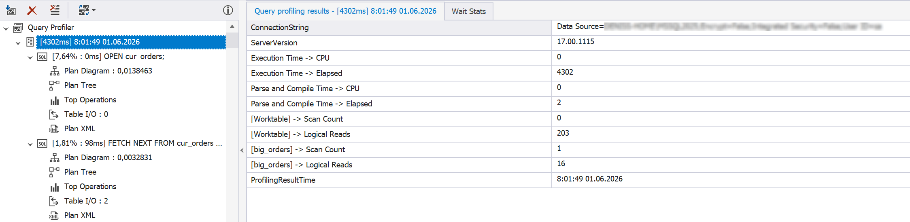
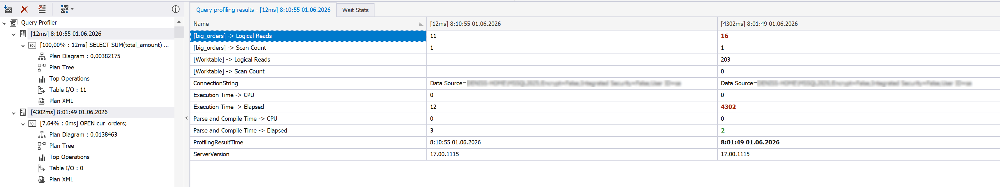

# Set-Based vs. Cursor

A cursor processes each row separately, which affects query performance, especially in large tables. Using a cursor can lead to the following performance issues:

- Increased number of context switches
- Higher CPU time
- Longer elapsed time
- Poor scalability

## How Query Profiler can help

Query Profiler provides many useful metrics that allow you to monitor and analyze query performance, such as **Execution Time -> CPU**, **Execution Time -> Elapsed**, and **Logical Reads**. These metrics can help you improve the performance of a query that contains a cursor by comparing the before and after values.

## Example

Execute the following query in the Query Profiler mode.

```sql
DECLARE
@total_amount money,
@grand_total money = 0;
 
DECLARE cur_orders CURSOR LOCAL FAST_FORWARD
FOR
SELECT TOP (50)
total_amount
FROM sales.big_orders
ORDER BY order_id;
 
OPEN cur_orders;
 
FETCH NEXT
FROM cur_orders
INTO @total_amount;
 
WHILE @@FETCH_STATUS = 0
BEGIN
 
SET @grand_total += @total_amount;
 
FETCH NEXT
FROM cur_orders
INTO @total_amount;
 
END
 
CLOSE cur_orders;
DEALLOCATE cur_orders;
 
SELECT @grand_total AS grand_total;
GO
```

For this query, Query Profiler shows high CPU time, elapsed time, and logical read values.



The cursor processes data row by row, performing a FETCH operation for each row, increasing the execution time and resource consumption. To optimize this query, replace the cursor with a set-based approach that involves the SUM() aggregate function. This function processes all the rows in the range in a single operation.

```sql
SELECT
SUM(total_amount) AS grand_total
FROM
(
SELECT TOP (50)
total_amount
FROM sales.big_orders
ORDER BY order_id
) t;
```

As a result, the execution time and logical read count decreased significantly. The key metrics show an improvement in performance.

| Metric | Cursor | Set-based | 
| -------| ------ | --------- |
| CPU time | 0 ms | 0 ms|
| Elapsed time | 4302 ms | 12 ms |
| Logical reads (`big_orders`) | 16 | 11 |
| Logical reads (Worktable) | 203 | 0 |


