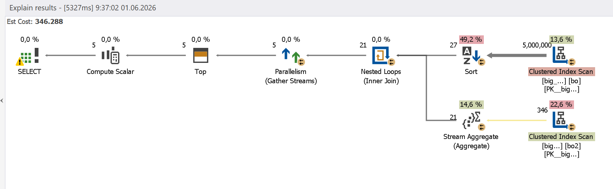
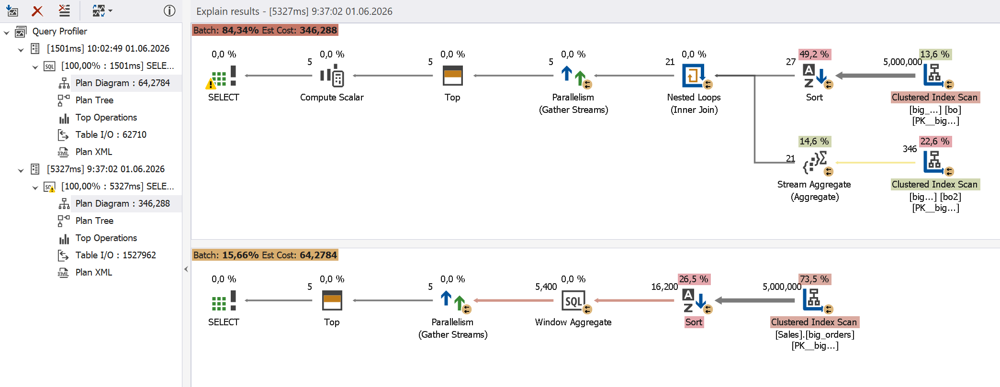

# Optimization With Window Functions

Subqueries can degrade the performance as follows, especially in large tables:

- Increased number of repeated data reads
- Higher logical read count
- Increased execution plan complexity

When subqueries are replaced with window functions such as LAG, LEAD, ROW_NUMBER, RANK, the performance improves due to the elimination of repeated table reads.

## How dbForge Query Profiler can help

The integrated Query Profiler in [dbForge Studios](https://www.devart.com/dbforge-studio.html) (and [dbForge Edge](https://www.devart.com/dbforge/edge/)) helps you locate the exact step in the execution plan where unnecessary reads occur and suggests improvements.

## Example

See the following query.

```sql
SELECT TOP (5)
    bo.order_id,
    bo.customer_id,
    bo.order_date,
    (
        SELECT MAX(bo2.order_date)
        FROM sales.big_orders bo2
        WHERE bo2.customer_id = bo.customer_id
          AND (
                bo2.order_date < bo.order_date
                OR
                (
                    bo2.order_date = bo.order_date
                    AND bo2.order_id < bo.order_id
                )
              )
    ) AS previous_order_date
FROM sales.big_orders bo
ORDER BY
    bo.customer_id,
    bo.order_date,
    bo.order_id;
```

This query retrieves the previous order date for the same customer. It uses a subquery that checks every row. As a result, the table is read repeatedly, which increases the execution time and cost.



If the subquery is replaced with the LAG() window function, the performance is dramatically improved in the following ways:

- Reduced execution time
- Reduced logical read count
- Simplified execution plan
- Eliminated repeated table reads

```sql
SELECT TOP (5)
    order_id,
    customer_id,
    order_date,
    LAG(order_date) OVER
    (
        PARTITION BY customer_id
        ORDER BY order_date, order_id
    ) AS previous_order_date
FROM sales.big_orders
ORDER BY
    customer_id,
    order_date,
    order_id;
```

These improvements are clearly visible in Query Profiler.


