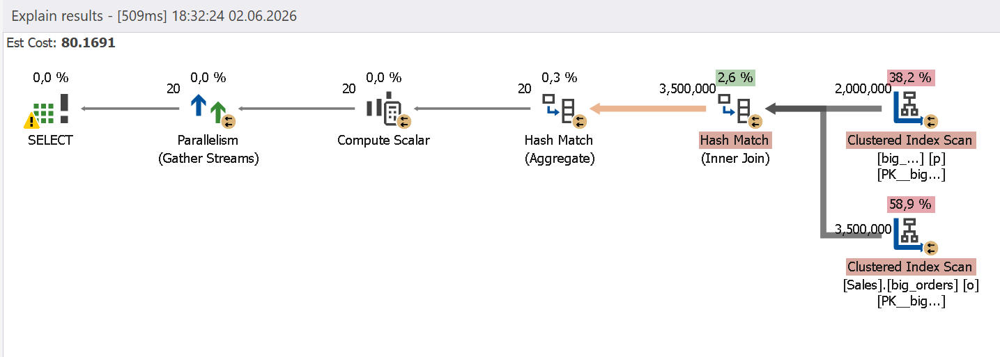
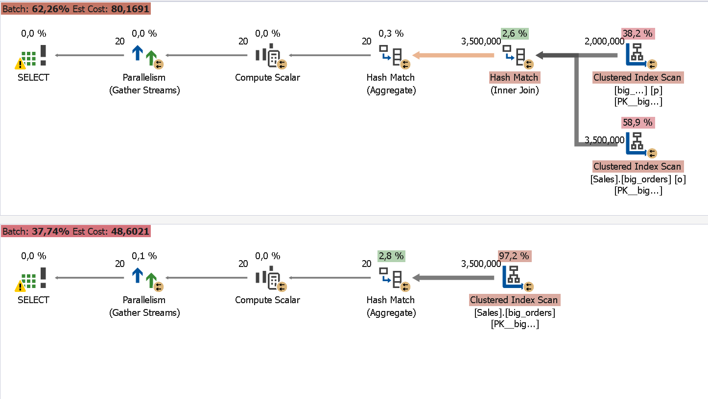

# Excessive JOINs

Unnecessary JOINs increase the amount of resources needed to match, combine, and process table rows. By joining several tables, you initiate the creation of additional datasets, which often leads to large table scans and, hence, suboptimal performance.

## How Query Profiler can help

Query Profiler provides metrics pinpointing JOINs that are not needed for query execution and only consume resources. By analyzing such metrics as read count and execution cost, you can find such JOINs and remove them.

## Example

Before starting the scenario, run the following query.

```sql
UPDATE STATISTICS sales.big_orders;
UPDATE STATISTICS person.big_person;
GO
CHECKPOINT;
GO
DBCC DROPCLEANBUFFERS;
GO
DBCC FREEPROCCACHE;
GO
```

The following query allows you to retrieve order statistics by territory. Run the query in the Query Profiler mode.

```sql
SELECT
    o.territory_id,
    COUNT(*) AS orders_count,
    SUM(o.total_amount) AS total_sales
FROM sales.big_orders o
INNER JOIN person.big_person p
    ON o.customer_id = p.person_id
WHERE o.order_status = 'S'
GROUP BY
    o.territory_id;
```

Query Profiler draws your attention to the high execution cost and additional table reads caused by the JOIN operation.



When you analyze the query and its execution, you see that the JOIN connects table `person.big_person`; however, this table's data is:

- Not returned by the SELECT statement
- Not used in the WHERE clause
- Not referenced in the GROUP BY clause
- Not used in the aggregate functions

This JOIN can be removed from the query without affecting its results.

```sql
SELECT
    territory_id,
    COUNT(*) AS orders_count,
    SUM(total_amount) AS total_sales
FROM sales.big_orders
WHERE order_status = 'S'
GROUP BY
    territory_id;
GO
```

Query execution shows the following improvements:

- The absence of JOIN operations
- No queries to table `person.big_person`
- A reduction in the logical read count
- A reduction in the execution cost
- A simplified execution plan


