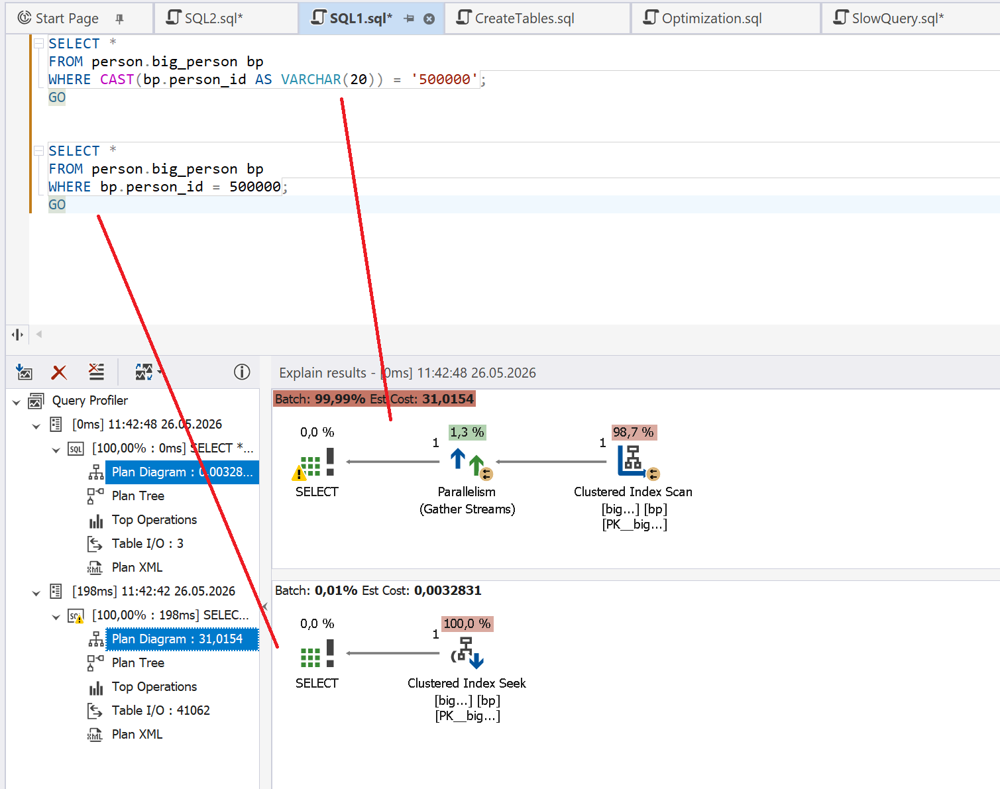

# Implicit Conversion

Implicit conversion occurs when query execution requires the conversion of one data type to another because the types used in a comparison, JOIN, or expression do not match. Unlike explicit conversion, implicit conversion does not use any special functions to convert data types, such as `CAST` or `CONVERT`. The following situations typically cause conversion:

- Comparing numeric columns to string literals
- JOINs involving columns with different data types
- Mixing `DATE` and `DATETIME` parameters
- Using parameters that do not match the columns they are applied to

Implicit conversion affects query performance in more than one way:

- Prevention of index usage, which results in full table scans
- Increased CPU consumption, if a conversion must be applied to each row in a table
- Slow JOINs, where one side of each JOIN must be converted

## How dbForge Query Profiler can help

The integrated Query Profiler in [dbForge Studios](https://www.devart.com/dbforge-studio.html) (and [dbForge Edge](https://www.devart.com/dbforge/edge/)) can locate exactly where implicit conversions occur and help you understand what is causing them. By monitoring such important metrics as CPU usage, execution time, read count, and memory consumption, Query Profiler detects the following cases where implicit conversion is likely to be found:

- High-cost scans
- Excessive reads
- Long-running queries
- Unusually high CPU usage

## Example

Before starting the scenario, run the following script.

```sql
IF EXISTS
(
    SELECT 1
    FROM sys.indexes
    WHERE name = 'ix_big_person_person_id'
      AND object_id = OBJECT_ID('person.big_person')
)
DROP INDEX ix_big_person_person_id
ON person.big_person;
GO
 
CREATE INDEX ix_big_person_person_id
ON person.big_person(person_id);
GO
```

Run the following query in the Query Profiler mode.

```sql
SELECT *
FROM person.big_person bp
WHERE CAST(bp.person_id AS VARCHAR(20)) = '500000';
```

This query converts column `bp.person_id` to `VARCHAR(20)` for every row, which prevents correct index usage and results in a **clustered index scan**.

If you remove the unnecessary conversion, you enable **clustered index seek**, which reduces the read count and improves the query efficiency.

```sql
SELECT *
FROM person.big_person bp
WHERE bp.person_id = 500000;
GO
```

A new run of Query Profiler shows an improvement in the query performance.


