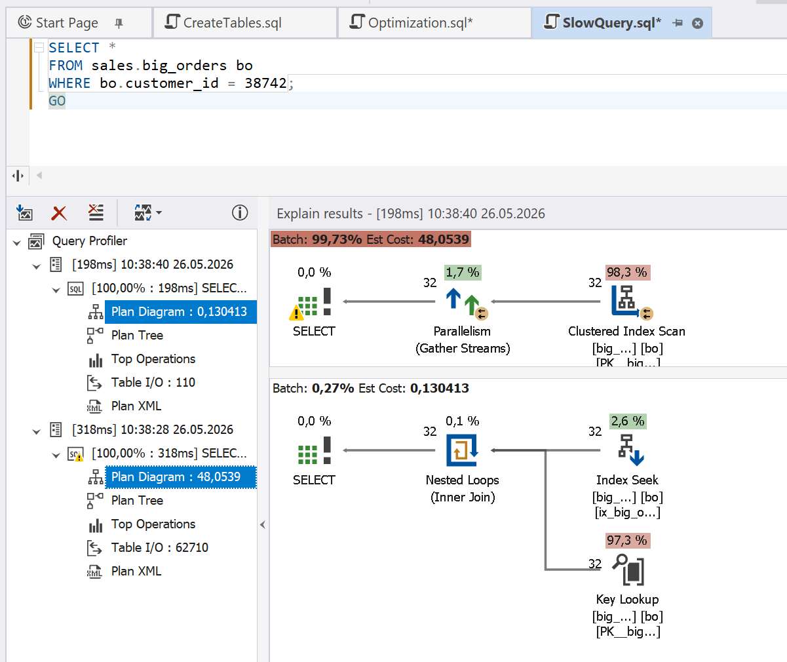

# Missing Index

A missing index can significantly degrade SQL query performance because the database engine must examine much more data than is necessary to return the result. Sometimes, a missing index causes a full table scan before the matching row is found. As a result, queries take longer, disk and memory I/O grows, CPU utilization becomes higher, and the risk of blocking or contention increases.

## How dbForge Query Profiler can help

The integrated Query Profiler in dbForge Studios (and dbForge Edge) helps you locate and fix missing indexes to improve query performance by pinpointing the following issues:

- Full table scans instead of index scans
- High read counts
- Excessive I/O costs
- Expensive execution plans

By identifying the root causes of slow performance, Query Profiler reveals improvement opportunities.

## Example

Run the following query in the Query Profiler mode.

```sql
SELECT *
FROM sales.big_orders bo
WHERE bo.customer_id = 38742;
```

This query performs poorly because a missing `customer_id` index causes the query to scan a full table. Query Profiler flags this issue in a warning.

To improve the performance, add the missing index, which will replace **clustered index scan** with **index seek**, reducing the read count and decreasing the execution plan cost.

```sql
CREATE INDEX ix_big_orders_customer_id
ON sales.big_orders (customer_id);
```

A new run of Query Profiler shows that the cost is significantly reduced.


